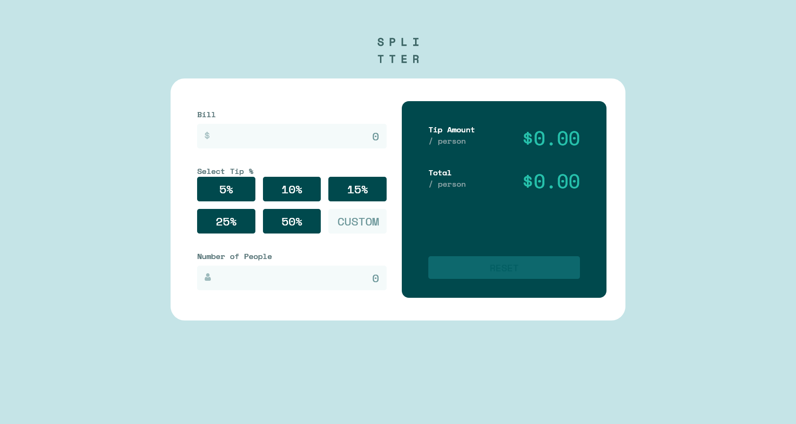

# Frontend Mentor - Tip calculator app solution

This is a solution to the [Tip calculator app challenge on Frontend Mentor](https://www.frontendmentor.io/challenges/tip-calculator-app-ugJNGbJUX). Frontend Mentor challenges help you improve your coding skills by building realistic projects.

## Table of contents

- [Frontend Mentor - Tip calculator app solution](#frontend-mentor---tip-calculator-app-solution)
  - [Table of contents](#table-of-contents)
  - [Overview](#overview)
    - [Screenshot](#screenshot)
    - [Links](#links)
  - [My process](#my-process)
    - [Built with](#built-with)
    - [What I learned](#what-i-learned)

## Overview

### Screenshot

### Links

- Solution URL: [Solution URL](https://www.frontendmentor.io/solutions/tip-calculator-app-solution-react-5HnxylWGL0)
- Live Site URL: [Live Site URL](https://ftp-droid.github.io/tip-calculator-app-main/)

## My process
I started with building the desktop version of the application using React. I followed the design of the given templates
as close as possible while ensuring a responsive design.

I chose to not use a currency library to manage the tip calculator as the differences between the estimated values and actual
values only vary by mere cents. Additionally, I wanted to ensure that anyone could understand the code I wrote without needing
to view the documentation of a currency API (which would prolong the time it would take for a future developer to understand the code).
On this note, I did not use any external packages/libraries besides React.

I chose to not implement the design feature where the outline of an input field is red and text displaying 'Can't be zero' is
visible when an input is 0. This is because the inputs do not take 0 (by itself) as a value with how I designed them. Consequently, it would be unecessary to have a feature that warns the user when an input is 0.

I used controlled inputs over uncontrolled inputs to manage the state of the inputs through React.

The Bill input was created with the assumption of an input value > 0.10.

### Built with

- Semantic HTML5 markup
- CSS modules
- Flexbox
- CSS Grid
- Mobile-first workflow
- [React](https://reactjs.org/) - JS library

### What I learned

I have a deeper understanding of React after working on this project. I am more comfortable with using controlled inputs and managing state
after completing this project.
